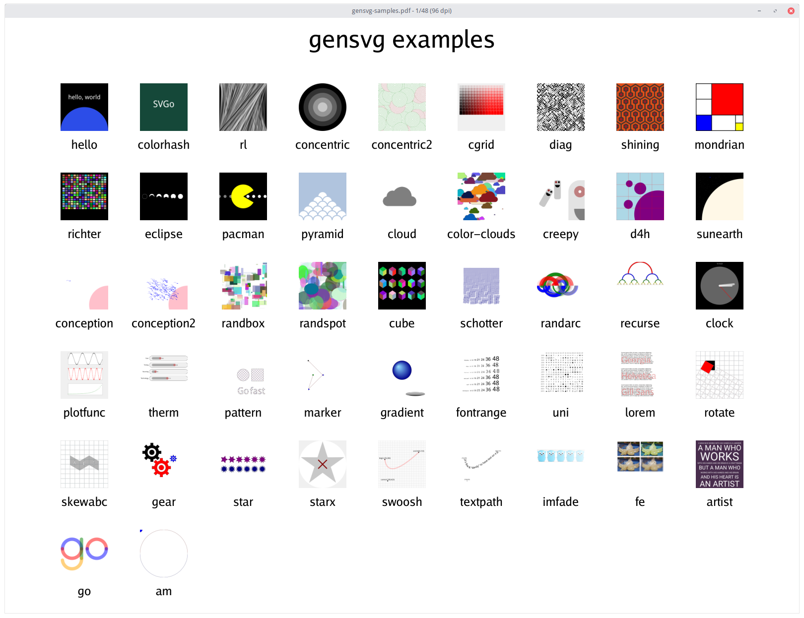
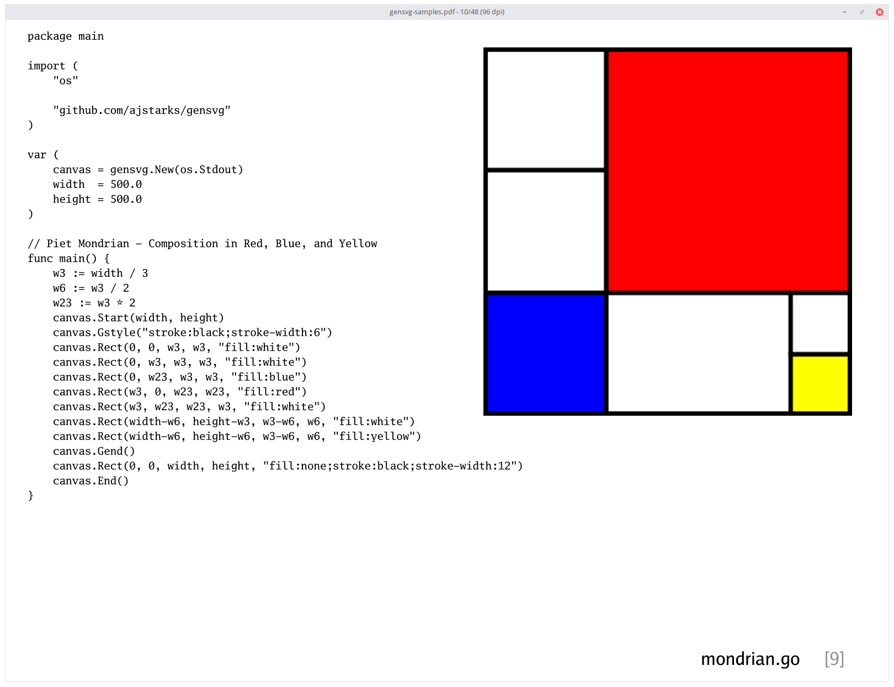
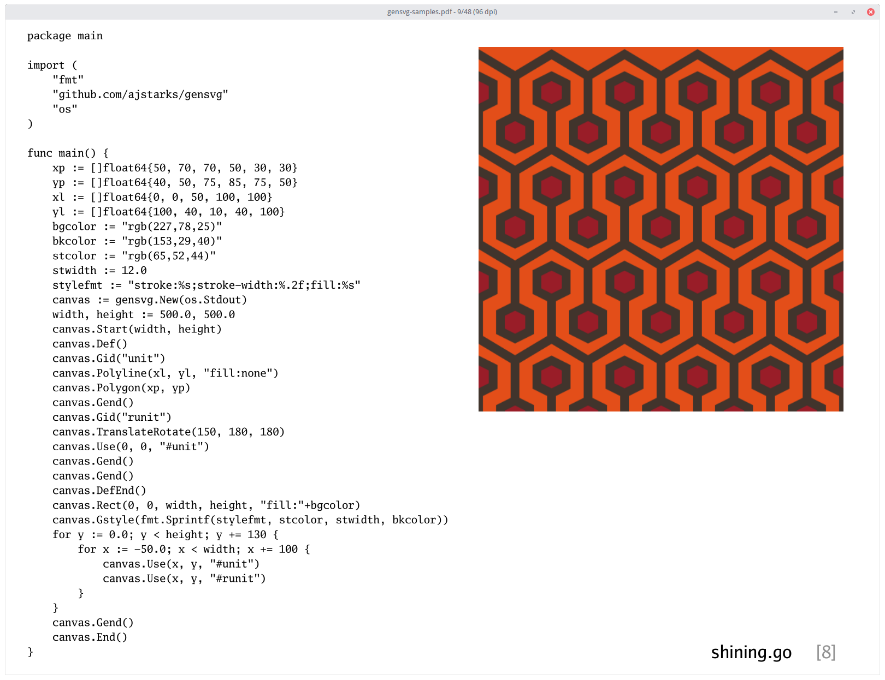

# Examples of the ```gensvg``` Package



This repo cantains nearly 50 sample programs showing the 
[gensvg SVG generation library](https://github.com/ajstarks/gensvg).

The document, ```gensvg-samples.pdf``` shows code+output on a page. ```generate``` runs each program and generates SVG and PNG output. ``mkdeck``` makes the documentation deck, ```gensvg-samples.pdf```

## Here is an example page:



## And Another


