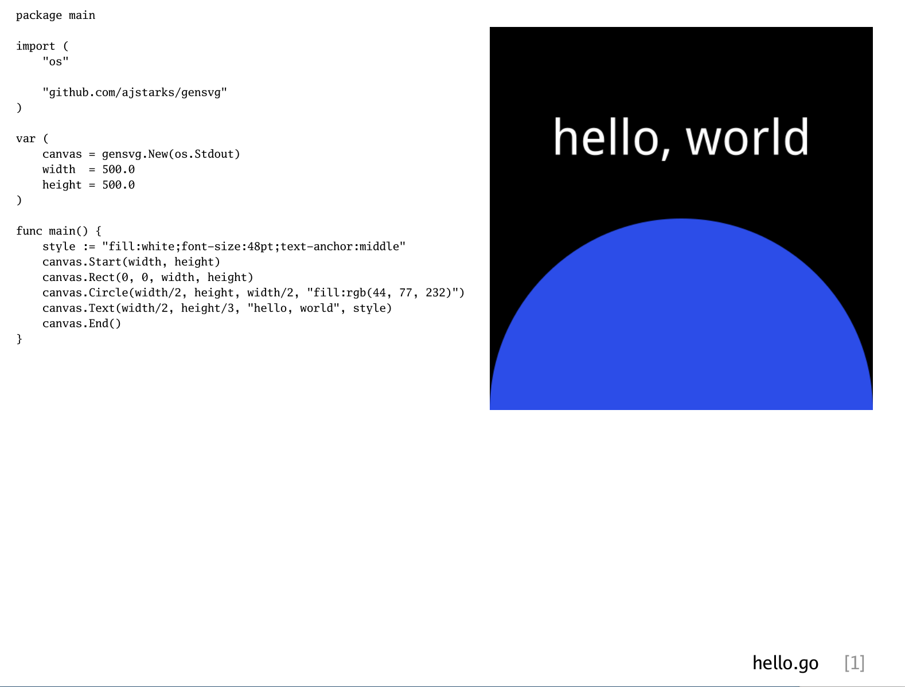

# gensvg-samples



This repo cantains nearly 50 sample programs showing the 
[gensvg SVG generation library](https://github.com/ajstarks/gensvg).

Each sample is collected with code+output on a page  in ```gensvg-samples.pdf```

The script ```generate``` will run each program and generate SVG and PNG output.

The script ```mkdeck``` generated the documentation deck, ```gensvg-samples.pdf```
